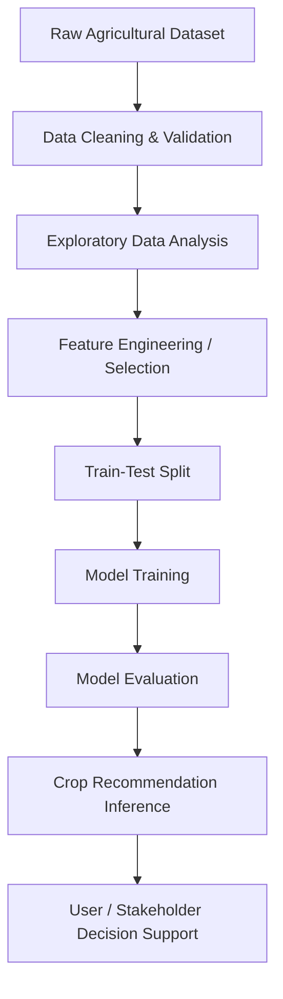
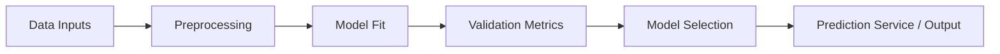
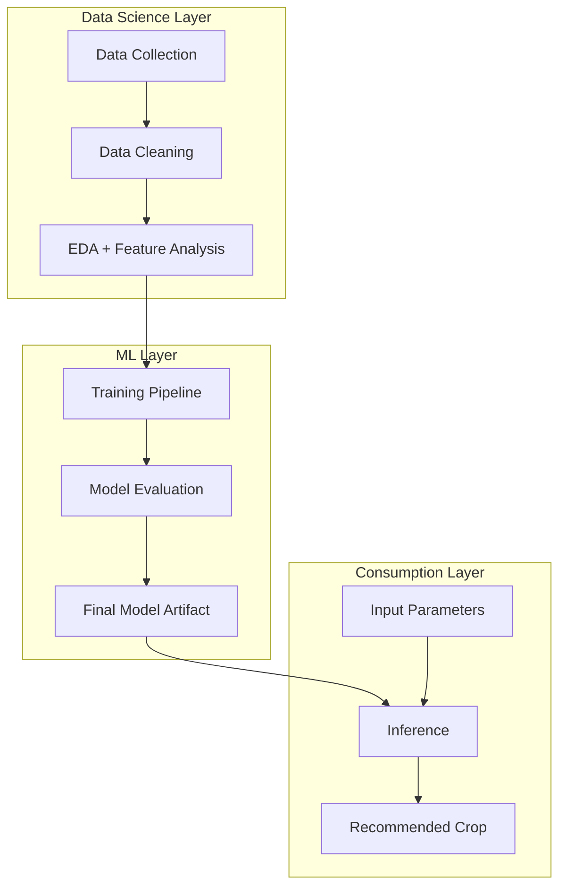

# 🌱 Crop Recommender — Applied ML + Data Analytics Project

A practical **Machine Learning + Data Analytics** solution that helps identify suitable crops based on environmental and soil conditions.  
This project demonstrates an end-to-end analytics workflow—from data understanding and preprocessing to model training and actionable recommendation output.

---

## 📌 Why this project matters

Agriculture decisions are often affected by multiple variables such as nitrogen, phosphorus, potassium, rainfall, humidity, pH, and temperature.  
This project frames crop selection as a **supervised multi-class classification** problem and uses historical data to recommend likely crop choices.

From a recruiter perspective, this repo reflects competencies in:

- **Data Science:** Feature-driven modeling, classification thinking, and result interpretation.
- **Machine Learning:** Pipeline-oriented training and prediction workflow.
- **Data Analytics:** Exploratory mindset, variable impact analysis, and business-facing output.
- **Problem Solving:** Translating a real-world domain problem into a measurable ML task.

---

## 🧠 ML Framing of the Problem

The core objective is to predict a target crop class from structured input features (soil nutrients + weather conditions).  
Conceptually:

- **Input variables:** Agro-climatic and soil health signals.
- **Target variable:** Recommended crop label.
- **Modeling task:** Multi-class classification.
- **Outcome:** Data-backed recommendation to support crop planning.

This setup showcases an applied ML lifecycle with clear business value: better planning, higher productivity potential, and reduced guesswork.

---

## 🔄 Project Workflow (Flow Chart)

This flow communicates a complete analytical journey that mirrors real Data Science project execution.

---

## 📊 Analytics Perspective

The analytics layer is as important as the model itself. Typical analysis objectives in this project include:

1. **Distribution Analysis** — Understanding spread and ranges of key agronomic variables.
2. **Correlation Study** — Identifying relationships between nutrients, weather factors, and crop outcomes.
3. **Class Balance Checks** — Ensuring target classes are represented adequately for fair learning.
4. **Signal Interpretation** — Translating patterns into stakeholder-friendly insights.

These steps improve trust in the model and make recommendations more explainable.

---

## 🤖 Machine Learning Perspective

The ML component demonstrates the practical modeling lifecycle:

- Preparing a clean feature matrix and target labels.
- Training a supervised classifier for crop prediction.
- Evaluating model behavior on holdout data.
- Generating recommendations from new unseen inputs.

### ML Lifecycle Diagram

---

## 🧩 End-to-End Architecture

This structure highlights that the project is not only about model training but about delivering a usable decision-support output.

---

## 💼 Recruiter-Friendly Skills Demonstrated

### Data Analytics Skills
- Structured problem decomposition.
- Exploratory analysis and insight generation.
- Data quality checks and feature-level reasoning.

### Data Science Skills
- Converting domain problems into ML-ready formulation.
- Feature-target mapping and experiment orientation.
- Insight communication for non-technical stakeholders.

### Machine Learning Skills
- Supervised classification workflow.
- Evaluation-aware model development.
- Prediction-driven application logic.

---

## 🚀 Business and Impact Narrative

In real-world agriculture and agri-advisory contexts, a crop recommendation system can:

- Support data-backed planting decisions.
- Reduce dependence on purely heuristic choices.
- Improve consistency in recommendations.
- Enable scalable advisory systems for multiple regions.

This positions the project as a meaningful blend of **ML engineering + analytics storytelling + domain relevance**.

---

## ✅ Quick Resume Summary (You can reuse this)

> Built an end-to-end Crop Recommendation project using supervised Machine Learning and Data Analytics techniques. Performed structured data preparation, exploratory analysis, and classification modeling to generate actionable crop predictions from soil and climate features, demonstrating practical problem-solving in an AgriTech use case.

---

## 🛠 Suggested Next Enhancements

- Add model comparison table (e.g., baseline vs tuned models).
- Add evaluation dashboard snapshots (confusion matrix, class-wise metrics).
- Add explainability visuals (feature importance / SHAP-style interpretation).
- Add lightweight deployment endpoint for real-time recommendations.

These extensions can further strengthen the portfolio value for Data Science and ML roles.
